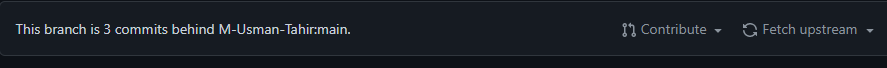
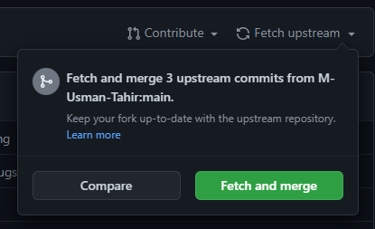
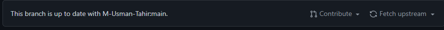

# How to Contribute

## Clone the project
First of all Fork the repo.

Then type the following command on the terminal to clone the repo keeping in mind to replace the `{your-user-name}` with your github user name.
```terminal
git clone https://github.com/{your-user-name}/voice-controlled-departmental-noticeboard
```
Now you need to move to the project directory.
```terminal
cd voice-controlled-departmental-noticeboard
```

## Make the Changes
Change or add the things what you think can make the app better.

## Make Pull Request
### Step 1
First of all you need to check if there are any new commts in the main repo or in other words that your repo is behind the main repo.
<br>


Click on the `Fetch upstream` drop down button.

  
and click on the `Fetch and merge` button.  
The repo will be up-to-date with the main branch.
<br>



### Step 2
Add files to the staging area in git with the following command
```terminal
git add .
```
Here . means that you are adding all the files that you added or updated.
In case you want any specific file you can write the name of the file like `git add {filename}`

### Step 3
Now commit the changes you put in the staging area by following command.
```terminal
git commit -m "Some useful message about the changes"
```

### Step 4
Now push the changes to the github repo (It will be your repo which is forked.) by the following command
```
git push
```

### Step 5
Now simply open up repo and click on `Contribute` and create a pull request.


<div align="center">

# Project Maintainer

[](https://github.com/M-Usman-Tahir)
<br>[Muhammad Usman Tahr](https://github.com/M-Usman-Tahir "View Profile")<br>

# Project Contributors

<a href="https://github.com/M-Usman-Tahir/voice-controlled-departmental-noticeboard">
  
</a>
<br>
<br>
<br>
<br>
We will be more than happy to merge your request. Try be a little useful ✨
</div>
